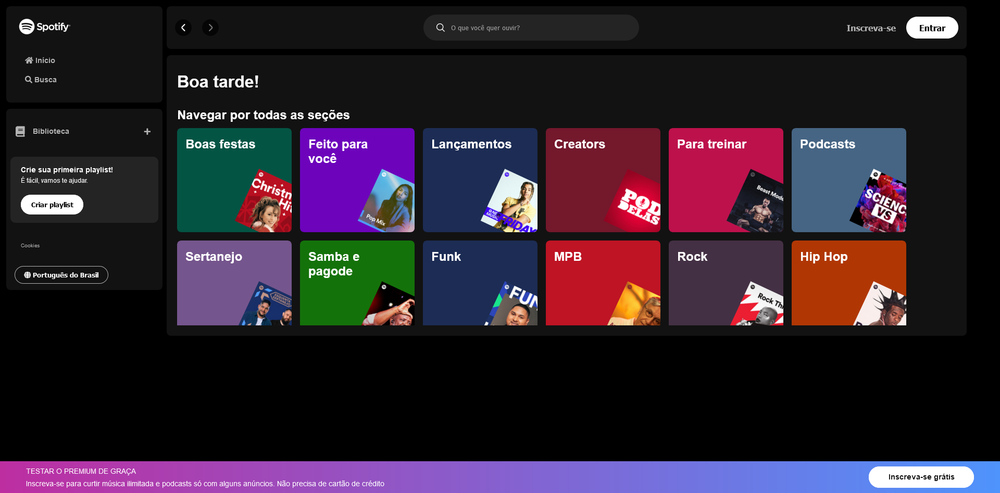

# Imersão Front-End Alura - Página do Spotify



## Menu

- [Descrição](#descrição)
  - [Principais recursos incluem](#principais-recursos-incluem)
- [Tecnologias Utilizadas](#tecnologias-utilizadas)
- [Estrutura de Pastas](#estrutura-de-pastas)
  - [Arquivos Principais](#arquivos-principais)
- [Como Instalar e Rodar o Projeto](#como-instalar-e-rodar-o-projeto)
  - [Configuração](#configuração)
  - [Casos de Uso Comuns](#casos-de-uso-comuns)
  - [Solução de Problemas](#solução-de-problemas)
- [Projeto ao Vivo](#projeto-ao-vivo)
- [Fluxo de Dados](#fluxo-de-dados)
- [Licença](#licença)
- [Autor](#autor)

## Descrição

Este projeto é uma aplicação web de busca de artistas que permite aos usuários encontrar e exibir informações sobre artistas musicais. A aplicação fornece uma interface simples e intuitiva para pesquisar artistas por nome, com resultados exibidos em tempo real.

### Principais recursos incluem

- Busca dinâmica de artistas por nome.
- Exibição de informações do artista, incluindo nome e imagem.
- Integração com uma API local para buscar dados dos artistas.
- Design responsivo para diferentes tamanhos de tela.

## Tecnologias Utilizadas

- **HTML**: Estruturação da página web.
- **CSS**: Estilização da aplicação, incluindo design responsivo.
- **JavaScript**: Lógica de busca e interação com a API.
- **Fetch API**: Para requisições assíncronas ao backend.
- **JSON**: Formato de dados utilizado para armazenar informações dos artistas.

## Estrutura de Pastas

```
imersao-frontend-alura/
├── api-artists/
│ └── artists.json
├── src/
│ ├── css/
│ │ ├── main.css
│ │ ├── general.css
│ │ ├── reset.css
│ │ ├── vars.css
│ │ ├── footer.css
│ │ ├── sidebar.css
│ │ └── media-queries.css
├── screenshot/
│ └── tela-principal.png
├── index.html
├── script.js
├── .gitignore
└── README.md
```

### Arquivos Principais:

- **index.html**: Ponto de entrada principal da aplicação.
- **script.js**: Contém a lógica JavaScript principal para a funcionalidade de busca e interação com a API.
- **api-artists/artists.json**: Armazena os dados dos artistas utilizados pela aplicação.
- **src/css/**: Diretório contendo arquivos CSS para estilização da aplicação.

## Como Instalar e Rodar o Projeto

Pré-requisitos:

- Um servidor web local (por exemplo, Node.js com http-server, LiveServer do VSCode).

1. Clone o repositório para sua máquina local:

```
git clone https://github.com/seu-usuario/imersao-frontend-alura.git
```

2. Navegue até o diretório do projeto

```
cd imersao-frontend-alura
```

3. Inicie seu servidor web.

4. Abra um navegador web e acesse o endereço gerado pelo seu servidor local

### Configuração

A aplicação utiliza um endpoint de API local para buscar dados dos artistas. Por padrão, está configurado para http://localhost:3000/artists. Certifique-se de que seu servidor backend esteja rodando e servindo os dados dos artistas neste endpoint.

Se você precisar alterar o endpoint da API:

1. Abra o arquivo script.js.
2. Localize a constante apiUrl próxima ao topo do arquivo.
3. Atualize a URL para corresponder ao seu endpoint de API:

```
const apiUrl = "http://seu-endpoint-api.com/artists";
```

### Casos de Uso Comuns

1. Busca de artistas:

- Na página principal, localize o campo de entrada de busca.
- Comece a digitar o nome de um artista.
- Conforme você digita, a aplicação irá automaticamente buscar por artistas correspondentes.
- Se uma correspondência for encontrada, o nome e a imagem do artista serão exibidos.

2. Exibição de playlist padrão:

- Se o campo de busca estiver vazio, a aplicação mostrará um resultado de playlist em vez disso.

### Solução de Problemas

- Nenhum resultado exibido ao realizar a busca:

1. Verifique o console do navegador para mensagens de erro.
2. Confirme se o endpoint da API está correto e acessível.
3. Certifique-se de que o arquivo artists.json está formatado corretamente e contém dados válidos.

- Estilos não sendo aplicados corretamente:

1. Verifique se todos os arquivos CSS no diretório src/css/ estão sendo carregados.
2. Verifique se não há erros de sintaxe CSS inspecionando as ferramentas de desenvolvedor do navegador.

- Problemas de desempenho:

1. Monitore as requisições de rede nas ferramentas de desenvolvedor do navegador para garantir chamadas eficientes à API.
2. Considere implementar debouncing na entrada de busca para reduzir o número de chamadas à API e melhorar o desempenho.

## Projeto ao Vivo

[Link do Projeto ao vivo]()

## Fluxo de Dados

A aplicação segue um fluxo de dados simples para a funcionalidade de busca de artistas:

1. Entrada do usuário: O usuário digita no campo de busca.
2. Escuta de eventos: O script escuta eventos de entrada no campo de busca.
3. Requisição à API: Quando uma entrada é detectada, a aplicação envia uma requisição ao endpoint da API.
4. Busca de dados: A API retorna um objeto JSON contendo informações dos artistas.
5. Filtragem de dados: Os dados recebidos são filtrados com base no termo de busca do usuário.
6. Atualização da exibição: Os resultados filtrados são usados para atualizar o DOM, mostrando o nome e a imagem do artista correspondente.

```
[Entrada do Usuário] -> [Listener de Eventos] -> [Requisição à API] -> [Busca de Dados]
                                                                           |
                                                                           v
[Atualização da Exibição] <- [Manipulação do DOM] <- [Filtragem de Dados]
```

_Nota: Atualmente, a API retorna todos os artistas, e a filtragem é feita no lado do cliente. Para conjuntos de dados maiores, considere implementar a filtragem no lado do servidor para melhorar o desempenho._

## Licença

Este projeto está licenciado sob a Licença MIT. Veja o arquivo [LICENSE](https://github.com/Melksedeque/imersao-dev-frontend?tab=MIT-1-ov-file) para mais detalhes.

## Autor

- GitHub - [Melksedeque Silva](https://github.com/Melksedeque/)
- FrontEndMentor - [@Melksedeque](https://www.frontendmentor.io/profile/Melksedeque)
- Twitter / X - [@SouzaMelk](https://x.com/SouzaMelk)
- LinkedIn - [Melksedeque Silva](https://www.linkedin.com/in/melksedeque-silva/)
